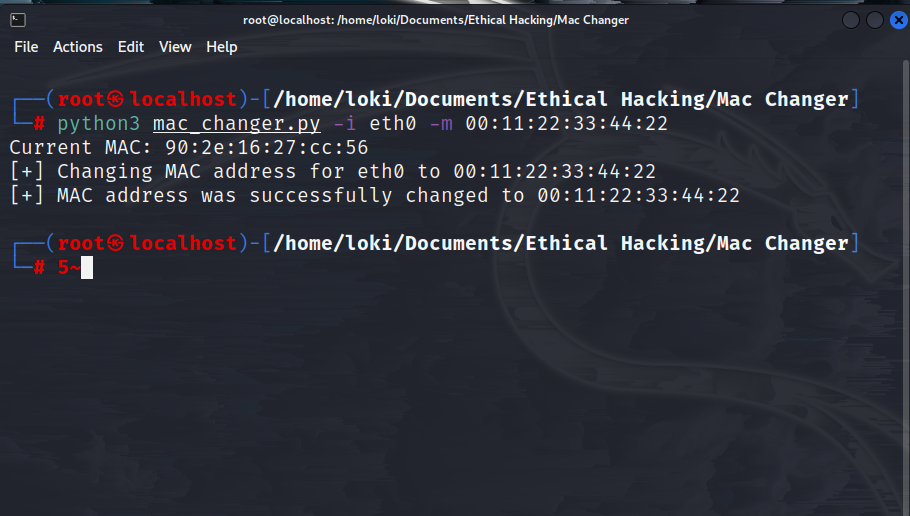

# MAC Address Changer
The term MAC address is an acronym for Media Access Control Address. The MAC Address refers to a unique identifier that gets assigned to a Network Interface Card/ Controller (NIC). It has a 64-bit or 48-bit address linked and connected to the concerned network adapter. The MAC Address can exist in a hexadecimal format. This type of address exists in six separate sets of two characters/ digits – separated from each other using colons.


# Why to change MAC Address?
Changing the assigned MAC address may allow the user to bypass access control lists on servers or routers, either hiding a computer on a network or allowing it to impersonate another network device.

## Usage

Clone the github repository and change the directory
```bash
git clone https://github.com/okieLoki/MAC-Address-Changer
cd MAC-Address-Changer
```
Run python3 to executive the file
```bash
python3 mac_changer.py -i (interface) -m (mac address)
```
```bash                          
python3 mac_changer.py --interface i (interface) --mac (mac address)
```
To get help about the commands use the help command
```bash
python3 mac_changer.py --help
```
```bash                
python3 mac_changer.py -h
```

    
## Screenshots




## Python Libraries used:

- subprocess
- optparse
- regex


